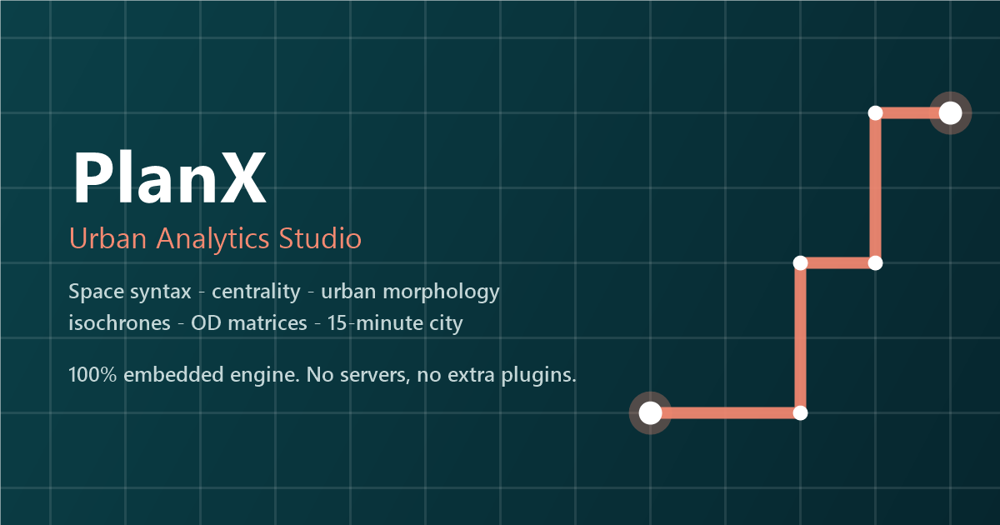

# PlanX

**Embedded urban analytics engine for QGIS: space syntax, centrality, urban morphology, OD matrices, isochrones and 15-minute-city scores — no external plugins or services.**

---

## Why PlanX?

Urban analysts usually need four or five separate tools — depthmapX for space syntax, a routing plugin for isochrones, momepy for morphology, UMEP for shadows, a server for OD matrices. PlanX embeds real implementations of all of them directly inside QGIS: a NumPy/SciPy analytics engine (with an identical pure-Python fallback) drives seventeen Processing algorithms that run locally, batch cleanly, and chain in the model designer. It is the flagship of the 15-plugin PlanX ecosystem.

## ✨ Features

- **Space syntax, embedded** — segment angular analysis (Hillier & Iida): integration, choice, **NACH/NAIN** at any metric radius. No depthmapX, no axial map.
- **The full centrality family** — degree, closeness (Wasserman–Faust + harmonic), straightness and exact **Brandes betweenness** on junctions *and* street segments, radius-limited or sampled for big networks.
- **Real network accessibility** — OD cost matrices with detour ratios, multi-facility **service-area isochrones**, nearest-facility allocation with load summaries.
- **15-minute city scores** — walking time to the nearest amenity of every category plus a 0–100 composite, straight from your own layers.
- **Urban morphology** — momepy-style building form metrics, **morphological tessellation**, Spacematrix **GSI/FSI/OSR/L** with readable class labels, street orientation entropy & meshedness (Boeing).
- **Microclimate screening** — UMEP-style **shadow casting** for any date/time (embedded NOAA solar position), **Sky View Factor**, and frontal-area wind-roughness grids.
- **Plan standards QA** — land-use balance against **configurable per-capita standards** (surplus/deficit per category), facility adequacy checking **capacity and distance together**, and dasymetric density grids.
- **Zero dependencies** — stock QGIS only: no QNEAT3, no GRASS modules, no servers, no pip installs. SciPy (bundled with official builds) accelerates automatically.
- **Verified math** — 77 engine unit checks against hand-computed values + 70 end-to-end assertions on real QGIS 3 LTR and QGIS 4.
- **PlanX Studio dock** — browse and launch the whole toolset from one panel.

## 🚀 Installation

**From the QGIS Plugin Hub (recommended):** `Plugins → Manage and Install Plugins…` → search for **"PlanX"** → *Install*.

**From a release zip:** download the latest zip from [Releases](https://github.com/YusufEminoglu/PlanX/releases) → `Plugins → Install from ZIP`.

Requires QGIS 3.22 or newer. No external Python dependencies.

## 📖 Quick start

1. Load a street network (OSM export, plan centerlines…) in a **projected CRS** and run **Prepare Network** to node it.
2. Run **Space Syntax (Segment Angular Analysis)** with radii `800, n` and style the output by `NACH_800` — your first integration/choice map.
3. Add facility points and run **Service Areas (Isochrones)** with breaks `250, 500, 1000` for catchment bands.
4. Drop building footprints in and run **Building Form Metrics** or **Morphological Tessellation → Spacematrix Density** for a density portrait.
5. Pick amenity layers and run **Multi-Amenity Access Score** for a 15-minute-city map.

## ⚙️ Reference

| Group | Tool | What it does |
|-------|------|--------------|
| Network Analysis | Prepare Network | Explode, node at intersections, dedupe, drop slivers |
| Network Analysis | OD Cost Matrix | Many-to-many network costs, detour ratio, desire lines |
| Network Analysis | Service Areas (Isochrones) | Multi-facility cost bands as edges + dissolved polygons |
| Network Analysis | Nearest Facility Allocation | Demand→facility assignment + facility load summary |
| Centrality & Space Syntax | Network Centrality | Degree, closeness, harmonic, straightness, Brandes betweenness (nodes + edges) |
| Centrality & Space Syntax | Space Syntax (Segment Angular) | Angular integration & choice, NACH/NAIN per metric radius |
| Urban Morphology | Building Form Metrics | Area, IPQ, convexity, elongation, orientation, courtyards, shared walls… |
| Urban Morphology | Morphological Tessellation | Voronoi plot proxies around buildings (Fleischmann method) |
| Urban Morphology | Spacematrix Density | GSI / FSI / OSR / L per block + Spacematrix class |
| Urban Morphology | Street Network Morphology | Orientation entropy & order, meshedness, junction typology |
| Accessibility | Multi-Amenity Access Score | 15-minute-city composite over any amenity layers |
| Microclimate | Shadow Casting (DSM) | Building/terrain shadows for any date & time, embedded sun position |
| Microclimate | Sky View Factor (DSM) | Visible-sky fraction per cell — heat island & canyon studies |
| Microclimate | Frontal Area Index | λf / λp wind-roughness grid (Grimmond & Oke) |
| Plan Standards & QA | Land-Use Balance | Per-capita areas vs configurable standards, surplus/deficit |
| Plan Standards & QA | Facility Adequacy | Capacity + network distance in one check, utilization & coverage |
| Plan Standards & QA | Density Grid | Area-share value disaggregation to a grid, density per hectare |

Methodology notes and the release roadmap live in [`docs/ROADMAP.md`](docs/ROADMAP.md).

## 🧩 Part of the PlanX ecosystem

PlanX is one of 15 open-source QGIS plugins for urban planning by the same author:

| Planning & analysis | CAD & production | 3D & visualization |
|---|---|---|
| [PlanX](https://github.com/YusufEminoglu/PlanX) — spatial-planning suite | [PlanX CAD Toolset](https://github.com/YusufEminoglu/PlanX-CAD) — drafting-grade CAD | [PlanX 3D City](https://github.com/YusufEminoglu/planx_3d_city) — Three.js city viewer |
| [GeoStats Lab](https://github.com/YusufEminoglu/planx_geostats) — spatial statistics | [EasyFillet](https://github.com/YusufEminoglu/EasyFillet) — tangent-arc fillet | [3D OSM Model](https://github.com/YusufEminoglu/osm_3d_model) — OSM → 3D city in browser |
| [Suitability Lab](https://github.com/YusufEminoglu/planx_suitability_lab) — raster MCDA | [Settlement Toolset](https://github.com/YusufEminoglu/PlanX-Settlement) — 9-stage settlement plans | [OSM Quick 3D](https://github.com/YusufEminoglu/osm_quick_3d) — OSM → native QGIS 3D |
| [DataCube Lab](https://github.com/YusufEminoglu/planx_datacube) — spatiotemporal cubes | [UIP Toolset](https://github.com/YusufEminoglu/PlanX-UIP) — Turkish master-plan automation | [Urban Procedural 3D](https://github.com/YusufEminoglu/planx_urban_procedural_3d) — parametric zoning lab |
| [Urban Resilience](https://github.com/YusufEminoglu/planx_urban_resilience) — 28 resilience tools | [ParcelFlux](https://github.com/YusufEminoglu/parcelflux) — parcel subdivision | [CartoLab](https://github.com/YusufEminoglu/planx_cartolab) — publication cartography |

## 📜 License & author

GPL-3.0 © [Yusuf Eminoğlu](https://github.com/YusufEminoglu) — bug reports and feature requests welcome in [Issues](https://github.com/YusufEminoglu/PlanX/issues).
